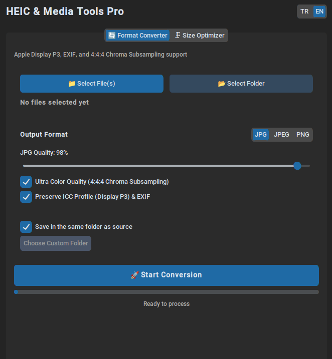
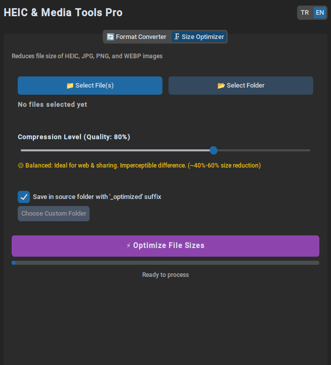

# HEIC & Media Tools Pro 📸🗜️

[](LICENSE)
[](https://www.python.org/)
[](#-stand-alone-executables-no-python-required)

> **Ultra High-Quality HEIC Converter & Smart Image Compressor**  
> Preserves Apple Display P3 ICC Profiles, retains EXIF metadata, and prevents color bleed with 4:4:4 Chroma Subsampling. Features a modern dark-themed GUI and cross-platform CLI.

---

## 📸 Preview

<p align="center">
  
  
</p>
<p align="center">
  <em><b>Left:</b> Lossless Format Converter &nbsp; | &nbsp; <b>Right:</b> Smart Media Size Optimizer</em>
</p>

---

## 🌟 Key Features

### 1. 🔄 Lossless HEIC Converter
- **Apple Display P3 Color Gamut:** iPhone HEIC photos are shot in wide Display P3. This tool embeds original ICC profiles to completely eliminate washed-out colors.
- **4:4:4 Chroma Subsampling:** Prevents compression blur and fringing on fine red/blue edges by encoding without subsampling (`subsampling=0`).
- **Target Formats:** Export to **JPG**, **JPEG** (custom quality 50–100%), or genuinely lossless **PNG**.
- **Full EXIF Preservation:** Keeps camera orientation, shooting date, and metadata intact.

### 2. 🗜️ Smart Media Compressor
- **Multi-Format Support:** Optimize **HEIC**, **JPG**, **JPEG**, **PNG**, and **WEBP** images.
- **Real-Time Tradeoff Guide:**
  - 🟢 **Light (85–95%):** Visually lossless, 100% sharpness retention (~20%–35% size reduction).
  - 🟡 **Balanced (70–84%):** Ideal for web and sharing, indistinguishable from original (~40%–60% size reduction).
  - 🔴 **Aggressive (50–69%):** Maximum space savings (~70%–80% size reduction).
- **Instant Savings Report:** Displays total megabytes saved and exact percentage reduction upon completion.

### 3. ⚡ Core Capabilities
- **Multi-Threaded Engine:** Utilizes all available CPU cores for lightning-fast batch processing.
- **Modern GUI (CustomTkinter):** Sleek, responsive, dark-mode native interface.
- **Bilingual Interface:** Instant real-time language toggle between English and Turkish.
- **Dual Mode (GUI & CLI):** Run interactively without arguments, or script headlessly via command-line arguments.

---

## 📦 Stand-Alone Executables (No Python Required)

You do **not** need Python installed. Grab the pre-built single-file binary for your OS directly from [Releases](https://github.com/KULLANICI_ADINIZ/heic-to-jpeg/releases):

| OS | Download | Instructions |
|---|---|---|
| **Windows** | `HEIC-Tools-Windows.zip` | Extract and double-click `HEIC-Tools.exe` |
| **Linux** | `HEIC-Tools-Linux` | `chmod +x HEIC-Tools-Linux` and double-click |
| **macOS** | `HEIC-Tools-macOS.zip` | Unzip and launch `HEIC-Tools.app` |

---

## 🛠️ Run from Source

### 1. Clone the Repository
```bash
git clone https://github.com/KULLANICI_ADINIZ/heic-to-jpeg.git
cd heic-to-jpeg
```

### 2. Create Virtual Environment & Install Dependencies

#### Linux / macOS:
```bash
python3 -m venv .venv
source .venv/bin/activate        # Bash / Zsh
# or: source .venv/bin/activate.fish  # Fish Shell
pip install -r requirements.txt
```

> **Linux Note (Tkinter):** If you encounter `No module named 'tkinter'`, install the system package:
> ```bash
> sudo apt install python3-tk    # Ubuntu / Debian
> sudo pacman -S tk              # Arch / CachyOS
> ```

#### Windows:
```powershell
python -m venv .venv
.venv\Scripts\activate
pip install -r requirements.txt
```

### 3. Launching

#### Graphical Interface (GUI):
```bash
python main.py
```

#### Command-Line Interface (CLI):
```bash
# Convert a single file with 98% quality (4:4:4 subsampling)
python main.py photo.heic -f jpg -q 98

# Batch convert a whole folder to lossless PNG
python main.py ./photos/ -f png -o ./converted/

# View CLI options
python main.py --help
```

---

## 🤝 Contributing

Contributions, issues, and feature requests are welcome! Feel free to check the [issues page](https://github.com/KULLANICI_ADINIZ/heic-to-jpeg/issues).

---

## 📄 License

This project is licensed under the [MIT License](LICENSE).
